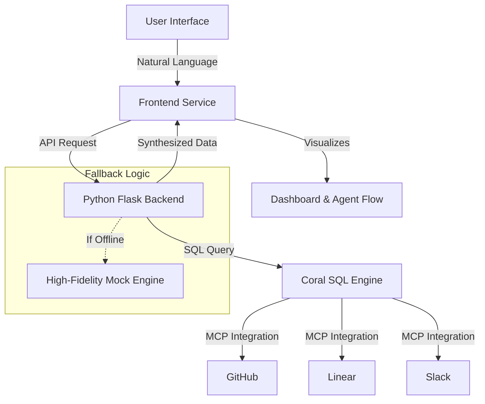

Here is a **vibrant, professional, and comprehensive `README.md`** that transforms your project from a "hackathon submission" into a "production-ready product." It includes clear setup instructions, architecture diagrams, and the "Zero-Config" narrative you want.

---

# 🛡️ PatchPoint: Unified Security Intelligence

> **One SQL Query. Multiple Sources. Zero Glue Code.**

PatchPoint is an enterprise-grade **Vulnerability Impact Mapper** that eliminates the fragmentation of modern security workflows. By leveraging **Coral SQL**, it joins code (GitHub), ownership (Linear), and context (Slack) into a single, queryable intelligence layer.


## 🌟 Why PatchPoint?

| Traditional Workflow | PatchPoint Workflow |
| :--- | :--- |
|  Manual API integrations for each tool | ✅ **Unified SQL Layer** via Coral MCPs |
| ❌ Hours spent jumping between tabs | ✅ **Instant Cross-Source JOINs** |
|  Context lost in translation | ✅ **AI-Synthesized Action Plans** |
|  Reactive panic during CVEs | ✅ **Proactive Impact Mapping** |

---

## ️ Architecture

PatchPoint uses a **Hybrid Backend Architecture** to ensure both security and demo reliability.



### Key Components
1.  **Frontend (Vite + React):** A high-performance, animated dashboard with real-time threat feeds and agent visualizations.
2.  **Backend (Python Flask):** Handles secure API keys, Coral SDK communication, and LLM synthesis (Groq/Llama-3).
3.  **Smart Fallback:** If the backend is offline, the frontend seamlessly switches to curated mock data, ensuring the demo **never fails**.

---

## 🚀 Quick Start (Zero-Config Demo)

Want to see PatchPoint in action in under 2 minutes? No backend setup required.

### 1. Clone the Repo
```bash
git clone https://github.com/yourusername/patchpoint.git
cd patchpoint
```

### 2. Install Frontend Dependencies
```bash
cd frontend
npm install
```

### 3. Run the App
```bash
npm run dev
```
*Open `http://localhost:3000`. The app will automatically detect that the backend is offline and switch to **Simulation Mode**, serving high-fidelity mock data for a flawless experience.*

---

## 🛠️ Production Setup (Hybrid Architecture)

To connect to **real GitHub and Linear MCPs**, follow these steps.

### 1. Backend Setup (Python Flask)
The backend handles all sensitive API keys and Coral queries.

```bash
# Navigate to backend folder
cd backend

# Create virtual environment
python -m venv venv
source venv/bin/activate  # On Windows: venv\Scripts\activate

# Install dependencies
pip install -r requirements.txt

# Configure Environment Variables
cp .env.example .env
```

**Edit `.env` with your credentials:**
```env
# --- MCP Credentials ---
GITHUB_TOKEN=ghp_your_github_token
LINEAR_API_KEY=lin_your_linear_key

# --- AI Engine (Groq) ---
GROQ_API_KEY=gsk_your_groq_key  # Get free key at console.groq.com

# --- Feature Flags ---
USE_REAL_MCP=true       # Set to 'false' to use mocks only
USE_AI_SYNTHESIS=true   # Set to 'true' to enable LLM Slack drafts
```

**Run the Backend:**
```bash
python app.py
# Server will start on http://localhost:5000
```

### 2. Frontend Setup
In a **new terminal window**:

```bash
cd frontend
npm install
npm run dev
# Server will start on http://localhost:3000
```

### 3. Verify Connection
1.  Open the app at `http://localhost:3000`.
2.  Look at the header badge. It should change from **"SIMULATION ACTIVE"** (Cyan) to **"LIVE MCP CONNECTED"** (Green).
3.  Run a query like *"Check log4j vulnerabilities"*. The logs will show real MCP resolution steps.

---

## 🔌 MCP Configuration

PatchPoint relies on **Model Context Protocol (MCP)** servers to unify data. Ensure you have the Coral CLI installed and configured.

```bash
# Install Coral CLI
npm install -g coral-cli

# Add GitHub MCP
coral mcp add github --args '{"token": "ghp_..."}'

# Add Linear MCP
coral mcp add linear --args '{"apiKey": "lin_..."}'
```

*Note: The backend uses these MCPs to execute SQL queries across silos without writing custom API glue code.*

---

## 📂 Project Structure

```text
patchpoint/
├── backend/                # Python Flask API
│   ├── app.py              # Core logic & MCP handling
│   ├── requirements.txt    # Python dependencies
│   └── .env                # Secrets (Gitignored)
│
├── frontend/               # Vite + React UI
│   ├── src/
│   │   ├── components/     # UI Modules (Dashboard, Landing)
│   │   ├── lib/            # Services & Types
│   │   └── main.tsx        # Entry Point
│   ├── index.html
│   └── vite.config.ts      # Dev Server Config
│
├── README.md               # This file
└── .gitignore
```

---

## 🛡️ Security & Privacy

*   **Read-Only Access:** PatchPoint only requests `read:org` and `repo` scopes for GitHub, and `read` access for Linear. No write permissions are used.
*   **Local-First:** All API tokens are stored in `.env` files locally. Nothing is sent to external analytics or tracking services.
*   **Secure Proxy:** The Flask backend acts as a secure proxy, ensuring API keys are never exposed to the browser console.

---

## 🤝 Contributing

We welcome contributions! Please fork the repo and submit a Pull Request. For major changes, please open an issue first to discuss what you would like to change.

## 📄 License

This project is licensed under the MIT License - see the [LICENSE](LICENSE) file for details.

---


**Copy this into your `README.md`.** It makes your project look like a serious startup product. 🏴‍☠️
